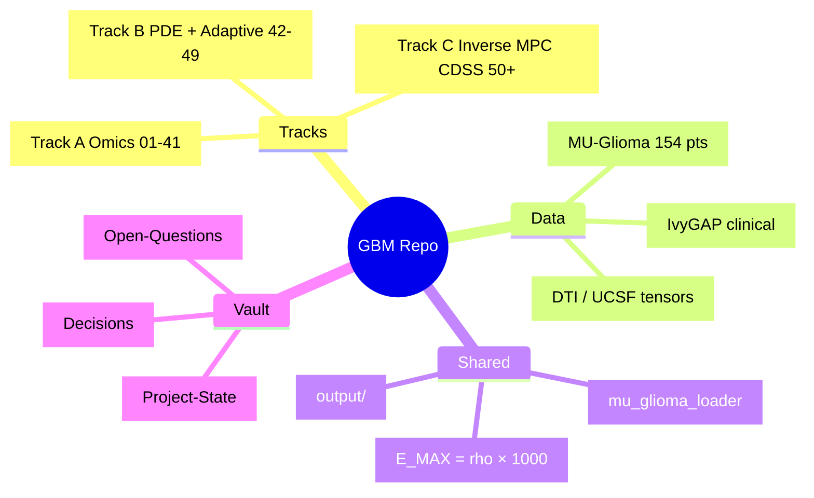
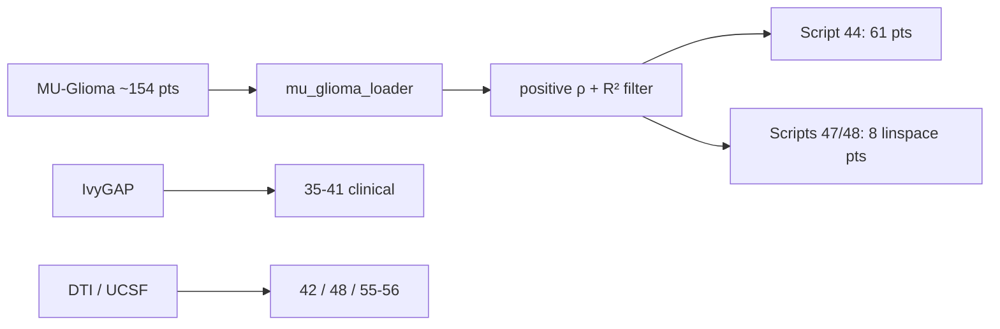
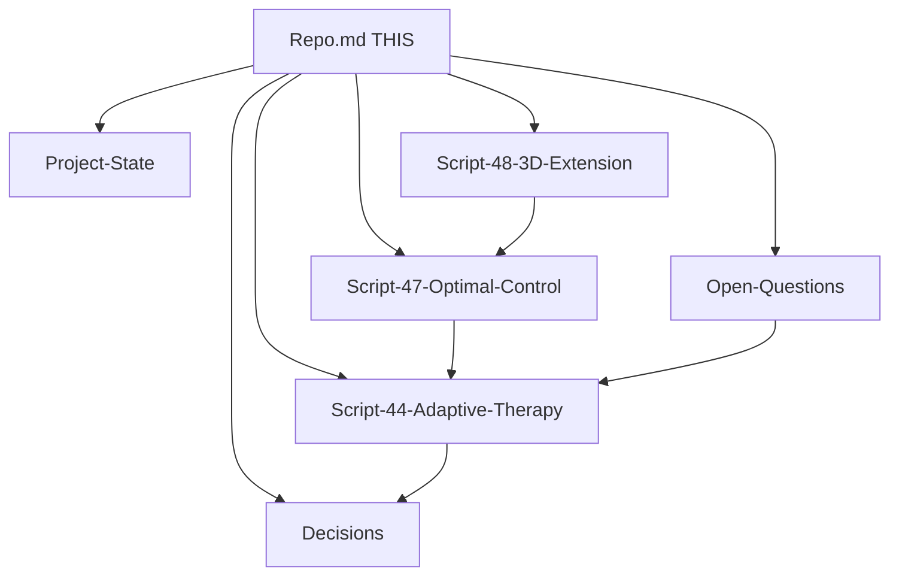

# Repo — Master Map of Content

> **Purpose:** One Obsidian hub for the whole glioblastoma modeling repo.  
> Use **Graph view**, **Outline**, and `[[wikilinks]]` as a mind-map memory.  
> Last scanned: 2026-09-24

**Jump:** [[Project-State]] · [[Decisions]] · [[Open-Questions]] · [[Script-44-Adaptive-Therapy]] · [[Script-47-Optimal-Control]] · [[Script-48-3D-Extension]]

---

## Mental model (one sentence)

Patient-specific **GBM computational oncology**: multi-omic risk (Track A) → **anisotropic PDE + stromal invasion** (Track B physics) → **adaptive / MPC dosing** (Track B therapy) → **3D DTI / inverse / CDSS** (Track C / Phase 3D).



---

## Repository layout

| Path | Role |
|------|------|
| `src/` | Numbered pipeline scripts + shared loaders/controllers |
| `output/` | All run artifacts (JSON, NPZ, PNG, HTML) |
| `data/` | Local datasets / tensors (often gitignored) |
| `docs/` | Methodology & review notes |
| `manuscript/` | Paper drafts / builders |
| `vault/` | Obsidian memory (this file + script notes) |
| `archive/` | Frozen Track A / Track B copies |
| `tests/` | Pytest (MPC, treatment models) |
| `tools/` | Vault RAG indexer, debug helpers |
| `kaggle_run/` | Cloud job wrappers |
| `visualization/` | Extra 3D viewers |
| `scripts/` | Figure generators |
| Root `*.py` | One-off validation / patient tests |

**Entry points**
- `python -m src.cli <n>` — run numbered script (`src/cli.py`)
- `README.md` — abstract + key findings (note: still has merge markers in places)
- `run_all.sh` / `run_all.ps1` — batch runners

---

## Three tracks

### Track A — Omics & biomarkers (Months 1–6)
**Scripts:** `01`–`41` (mostly). Status: 27/28/29 verified with committed outputs; SPIB saddle proof 5/5 PASS; real TCGA-GBM validation (n=518). The 'unverifiable' note in the README is outdated.

| Band | Scripts | Theme |
|------|---------|--------|
| Load / DE | 01–04 | Filter, UMAP, DE export |
| Attention / methods | 05–09 | Classical / transformer / hybrid benchmarks |
| CVAE + GAT/CGAT | 10–16, 54–55 | Latent space, graphs, baselines (scVI/NMF) |
| Dynamics proof | 17–22 | Velocity, Fokker–Planck, saddle / SPIB |
| Causal GRN | 23–26 | Transfer entropy, PID, validation |
| ABA / FK invasion | [[#Script 27–30 — Invasion physics]] | Lattice, Fisher–K, front speed |
| Virtual KO / TI | 31–34 | Knockout screen, therapeutic index |
| Clinical ingest | 35–41 | IvyGAP, survival, dose–response |

**Verified physics anchors (from [[Project-State]])**
- **27** ABA lattice — front velocity ~0.118–0.120
- **28** FK-PDE — numerical 3.62 vs analytical 4.00 (~9.4% err)
- **29** invasion — free-prop 26.6 vs analytical 28.3 µm/hr

### Track B — Anisotropic PDE + adaptive therapy (focus)
**Scripts:** `42`–`49`. This is the **current scientific spine**.

| Script | File | One-liner | Vault note |
|--------|------|-----------|------------|
| 42 | `42_anisotropic_pde.py` | 2D anisotropic FK on tracts | — |
| 43 | `43_stromal_feedback.py` | Stromal feedback, per-patient ρ | — |
| 44 | `44_adaptive_therapy.py` | Adaptive vs MTD, **61** real pts | [[Script-44-Adaptive-Therapy]] |
| 45 | `45_validation_synthesis.py` | Cohort synthesis / poster metrics | — |
| 46 | `46_sensitivity_analysis.py` | Sobol on real ρ / D ranges | — |
| 47 | `47_optimal_control.py` | MPC dual-drug, **8** real pts | [[Script-47-Optimal-Control]] |
| 48 | `48_3d_extension.py` | 50³ anisotropic 3D, **8** real pts | [[Script-48-3D-Extension]] |
| 49 | `49_interactive_3d_dashboard.py` | Plotly HTML from 48 artifacts | ⚠️ still expects PAT_ IDs unless updated |

**Shared calibration (see [[Decisions]])**
- `E_MAX_RATIO = 1000` → `E_max = ρ × 1000`
- Adaptive holidays: `THRESHOLD_OFF` (0.80 primary; 0.50 under test)
- Real params via `src/mu_glioma_loader.py` (`load_mu_glioma_params`, `real_cohort_stats`)

### Track C / Phase 3D+ — Inverse, robust MPC, DTI, CDSS
**Scripts:** `50`–`65`, plus DTI / digital-twin helpers.

| Band | Scripts | Theme |
|------|---------|--------|
| CDSS / DICOM / spatial omics | 50* (multiple files) | App, DICOM, deconvolution (naming collisions) |
| Inverse estimation | 51* | ρ, D from longitudinal volumes |
| Robust MPC / therapy PDE | 52–53, 57 | Uncertainty-aware dosing, spatial metrics |
| DTI 3D | 55–56* | Ingestion + anisotropic 3D DTI PDE |
| Multi-scale / RL | 56, 58–63 | Framework, RL steering, ablations |
| Virtual cohort / report | 64–65 | Cohort sim + final report |
| MU-Glioma ETL | 70–73 | Load / estimate / rebuild NPZ |

---

## Script atlas (numbered `src/`)

### 01–09 — Omics baselines
- `01_load_and_filter` → `02_preprocess_umap_de` → `03_finalize_de_and_export_for_nn` → `04_export_for_attention_model`
- `05_attention_gated_network`
- `06_method1_classical_baseline` · `07_method2_transformer` · `08_method3_hybrid` · `09_benchmark_comparison`

### 10–16 — Representation learning & graphs
- CVAE: `10_cvae_pretrain` → `11_cvae_extract_latent`
- GAT: `12_gat_build_graph` → `13_gat_train`
- CGAT: `14_cgat_evaluate` · `15_cgat_build_graph` · `16_cgat_train` (+ later `54`/`55` renumbers)
- Baselines: `15_baseline_scvi` · `16_baseline_nmf` (**duplicate numbers** — check filename)

### 17–26 — Phenotypic dynamics & GRN
- `17_gradient_diagnostic` · `18_csgt_framework` · `19_phenotypic_velocity`
- `20_fokker_planck_solver` · `21_drift_diffusion_analysis`
- `22_saddle_point_proof` (+ `22_spib_saddle_proof`, backup)
- `23_transfer_entropy_engine` → `24_causal_grn_builder` → `25_pid_analysis` → `26_grn_validation`

### 27–34 — Invasion & virtual pharmacology
- `27_aba_lattice` · `28_fisher_kolmogorov_pde` · `29_invasion_simulator` · `30_aba_analysis`
- `31_virtual_knockout_engine` · `32_combinatorial_screen` · `33_therapeutic_index` · `34_drug_gating_report`

### 35–41 — Clinical / survival bridge
- `35_ivygap_clinical_ingest` · `36_survival_analysis` · `37_clinical_validation_report`
- `38_real_cohort_ingest` · `39_penalized_survival`
- `40_spatial_recurrence_mapper` · `41_dose_response_model`

### 42–49 — Track B core (live science)
See [[#Track B — Anisotropic PDE + adaptive therapy (focus)]] and vault notes [[Script-44-Adaptive-Therapy]], [[Script-47-Optimal-Control]], [[Script-48-3D-Extension]].

### 50–65 — Inverse / MPC / DTI / RL / report
Many **number collisions** (same number, different files). Prefer full filename when linking.

| # | Competing files (pick carefully) |
|---|----------------------------------|
| 50 | `50_clinical_cdss_app` · `50_dicom_loader` · `50_spatial_genomics_deconv` |
| 51 | `51_inverse_parameter_estimation` · `51_joint_inverse_estimation` · `51_poroelastic_hybrid_solver` |
| 52 | `52_dti_anisotropic_solver` · `52_robust_mpc_controller` |
| 53 | `53_spatial_metrics` · `53_virtual_therapy_solver` |
| 54 | `54_cgat_build_graph` · `54_spatial_genomics_deconv` |
| 55 | `55_cgat_train` · `55_dti_3d_ingestion` · `55_mechanics_hybrid_pde` |
| 56 | `56_anisotropic_3d_dti` · `56_anisotropic_dti_pde` · `56_multi_scale_framework` |

### 70–73 — MU-Glioma parameter pipeline
- `70_load_mu_glioma` → `71_estimate_params` → `72_estimate_params_real` → `73_rebuild_cohort_npz`

---

## Shared libraries (non-numbered `src/`)

| Module | Use |
|--------|-----|
| `mu_glioma_loader.py` | **Canonical** real cohort params (`rho_per_day`, `V0_mm3`, `r_squared`, …) |
| `dti_loader.py` / `dicom_loader.py` / `load_ucsf_tensor.py` | Imaging tensors |
| `tmz_pk.py` / `timed_drug_infusion.py` / `radiation_model.py` | Treatment PK/PD |
| `treatment_aware_pde.py` / `hybrid_controller.py` | PDE + control glue |
| `resistance_env.py` / `trust_signal.py` | RL / adaptive env signals |
| `run_pipeline.py` / `run_digital_twin_pipeline.py` / `run_patient_digital_twin.py` | Orchestration |
| `cli.py` | Numbered script launcher |
| `neural_pde/` | FNO train / solve / benchmark |
| `rl/` | Chronotherapy RL training |
| `spib_*.py` / `pseudotrajectory_generator.py` | Landscape / trajectories |
| `uq_fno_ensemble.py` / `xai_saliency.py` | UQ + explainability |
| `create_*viewer*.py` / `create_master_dashboard.py` | Visualization builders |

---

## Data & cohorts



| Cohort | Who | Used by |
|--------|-----|---------|
| Full MU-Glioma | ~154 fitted | loader, Sobol (46), stats |
| Positive-ρ | 61 | [[Script-44-Adaptive-Therapy]] |
| Negative-ρ responders | 42 (~41%) | excluded from adaptive; paper Q in [[Open-Questions]] |
| 8-patient spread | linspace ρ, R²>0.7 | [[Script-47-Optimal-Control]], [[Script-48-3D-Extension]] |

**Same 8 IDs (47/48):**  
`PatientID_0235`, `_0089`, `_0150`, `_0038`, `_0164`, `_0251`, `_0188`, `_0123`

---

## Key scientific invariants

Locked decisions → [[Decisions]]

| Invariant | Value | Notes |
|-----------|-------|-------|
| Drug:growth scale | `E_MAX = ρ × 1000` | Scripts 44, 46, 47, 48 |
| Adaptive off threshold | 0.80 (test 0.50) | High-ρ stratification hypothesis |
| Dual-drug / MPC horizon | 14 d (script 47) | Don't casually change |
| 3D grid | 50³, dt=0.05, 180 d | Script 48 |
| Anisotropy | D_white / D_gray ≈ 10:1 | Tract corridor |
| Path pattern | `PROJECT_ROOT / "output"` | Prefer over `Path("output")` |

---

## Headline results (memory anchors)

| Source | Claim |
|--------|--------|
| [[Script-44-Adaptive-Therapy]] | Resistance: MTD median 99.2% vs adaptive 30.6%; 54/61 MTD selects more resistance; dose ~32% of MTD |
| [[Script-46-Sensitivity]] | rho_s S1=0.998 dominates TTP variance; all other parameters ST < 0.015 |
| [[Script-47-Optimal-Control]] | Dual-agent MPC rescues single-agent; Rf ≤0.05 for 6/8; fails at extreme ρ (0123) |
| [[Script-48-3D-Extension]] | Low-ρ MTD → 0 mm³; adaptive residual + high dose sparing; sparing collapses as ρ↑ |
| [[Project-State]] | 27/28/29 invasion physics verified; 43 stromal 14× mass variation |

**Honest framing (README):** adaptive is **non-inferior TTP** with **dose sparing**, not a claim of longer TTP in the high-selection regimen.

---

## Outputs that matter

| Artifact | Produced by | Consumer |
|----------|-------------|----------|
| `output/adaptive_cohort_summary.json` | 44 | Paper / vault |
| `output/adaptive_geometry_metrics.json` | 44 | Per-patient geometry |
| `output/dual_drug_comparison.json` | 47 | MPC 3-arm table |
| `output/3d_master_cohort_volumes.npz` | 48 | Script 49 dashboard |
| `output/3d_extension_summary.json` | 48 | Script 49 metadata (`anisotropy_ratio`) |
| `output/stromal_feedback_metrics.json` | 43 | Stromal claims |
| `output/master_cohort_summary.json` | 45 / synthesis | Poster |
| `TRACK_A_RESULTS.md` / `TRACK_B_RESULTS.md` | Root scratchpads | Working memory |

---

## Vault graph (Obsidian)



---

## Engineering traps (don't forget)

1. **Duplicate script numbers** (50–56) — always cite full filename.
2. **Script 49** still hardcodes `PAT_0000`…`0007`; 48 now writes `PatientID_*` NPZ keys — dashboard may need a follow-up.
3. **README** may still contain `<<<<<<<` merge markers — treat vault notes as truth over README when they conflict.
4. **Archive** (`archive/track_a`, `archive/track_b`) is historical; prefer live `src/`.
5. **Vault RAG:** after editing notes, `python tools/vault_index.py` ([[Open-Questions]]).
6. Root has many `check_*.py` / `test_*.py` / `patient_0004_*.py` — ad-hoc; not the pipeline spine.

---

## How to use this note as a mind map

1. Open **Graph view** filtered to `vault/` — this note is the hub.
2. Expand **Outline** (right sidebar) — each `##` is a map node.
3. Click `[[wikilinks]]` into deep notes; link new findings back here under [[#Headline results (memory anchors)]].
4. When a script graduates, add `vault/Script-XX-….md` and link it in the Track B table.
5. Keep [[Project-State]] as the *today* scratchpad; keep this file as the *atlas*.

---

## Quick command cheat sheet

```bash
# Activate venv, then:
python -m src.cli --list
python -m src.cli 44
python src/47_optimal_control.py
python src/48_3d_extension.py
python tools/vault_index.py
```

---

## Tags

#moc #repo #track-a #track-b #track-c #mu-glioma #adaptive-therapy #mpc #3d-extension #obsidian
